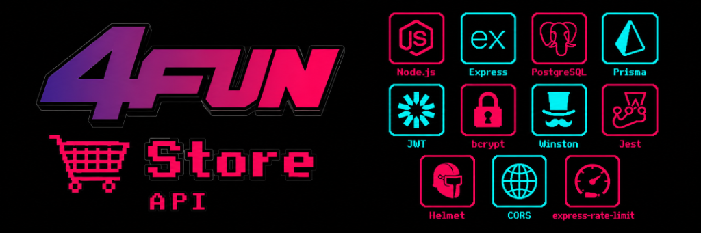
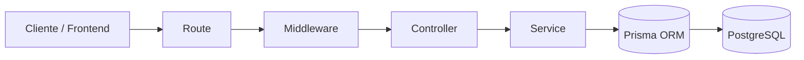

# 4Fun Store API

<p align="center">
  
</p>

<p align="center">
  
  
  
  
  
</p>

---

## Links rápidos

- **API desplegada**: [https://4fun-store-api.vercel.app](https://4fun-store-api.vercel.app)
- **Verificación de estado (Health check)**: [https://4fun-store-api.vercel.app/health](https://4fun-store-api.vercel.app/health)
- **Web desplegada**: [https://4fun-store-web.vercel.app](https://4fun-store-web.vercel.app)
- **Acta de entrega en Frontend**: [m6-acta-entrega-final.md (en web repo)](https://github.com/EnriqueMartinez26/4fun-store-web/blob/main/docs/m6-acta-entrega-final.md)
- **Entrega académica final**: `v1.0.0-thesis`

---

API REST de **4Fun Store**, sistema e-commerce académico orientado a la venta de videojuegos digitales. Implementa usuarios, autenticación, catálogo, carrito, órdenes, entrega de claves digitales y administración de transacciones bajo un flujo de aprobación.


## Estado académico final

| Item | Estado |
| :--- | :--- |
| Versión académica | `v1.0.0-thesis` |
| Rama principal consolidada | `main` |
| Ramas de trabajo conservadas | `nano`, `kuki` |
| Despliegue API | [https://4fun-store-api.vercel.app](https://4fun-store-api.vercel.app) |
| Verificación de estado (Health check) | [https://4fun-store-api.vercel.app/health](https://4fun-store-api.vercel.app/health) |
| Frontend productivo | [https://4fun-store-web.vercel.app](https://4fun-store-web.vercel.app) |
| Base de datos | Supabase PostgreSQL |
| Estado de entrega | Cerrado y validado como Hito M6 |

## Estado técnico actual

- Esquema relacional consolidado en **3FN estricta**.
- El stock operativo se deriva de `DigitalKey` disponibles; no se persiste un stock manual en `Product`.
- El total de la orden se calcula desde `OrderItem` + `shippingPrice`; no se persiste un total redundante.
- El subsistema de cupones fue eliminado por completo.
- El seed actual limpia la base y la reconstruye con datos realistas de prueba.

## Alcance

Este backend forma parte de una tesis de Tecnicatura en Programación. Su objetivo es demostrar análisis, diseño e implementación de un sistema web con reglas de negocio reales, persistencia relacional, seguridad básica, separación por capas y trazabilidad de operaciones.

El sistema se enfoca exclusivamente en videojuegos digitales. La entrega del producto se modela mediante claves digitales asociadas a órdenes pagadas.

## Decisiones técnicas

El modelo inicial tenía un problema real: `Product` guardaba el stock como campo manual, y el total de la orden se guardaba aparte de sus `OrderItem`. Ninguno de los dos dependía de la fuente real — el stock no reflejaba las `DigitalKey` disponibles, el total no reflejaba los ítems de la orden.

Se normalizó el esquema a 3FN. Ahora el stock se deriva de las `DigitalKey` disponibles y el total se calcula desde `OrderItem` + `shippingPrice`, ambos en tiempo real. Se sacó también el subsistema de cupones completo: sumaba complejidad y no aportaba al objetivo académico de la tesis.

Los flujos críticos (auth, órdenes, transacciones, productos) están cubiertos por tests automatizados con Jest: 20 tests pasando, 44,6% de cobertura de statements concentrada en esos servicios.

## Despliegue académico

API publicada: [https://4fun-store-api.vercel.app](https://4fun-store-api.vercel.app)

Verificación de estado (Health check): [https://4fun-store-api.vercel.app/health](https://4fun-store-api.vercel.app/health)

Respuesta esperada:

```json
{
  "status": "ok"
}
```

Frontend productivo autorizado por CORS: [https://4fun-store-web.vercel.app](https://4fun-store-web.vercel.app)

## Funcionalidades principales

* Registro e inicio de sesión.
* Autenticación con JWT y cookies HttpOnly.
* Roles: comprador, vendedor y administrador.
* Catálogo de videojuegos digitales.
* Clasificación por plataforma y género.
* Carrito persistente por usuario.
* Creación de órdenes.
* Marcado administrativo de pago simulado.
* Asignación de claves digitales.
* Creación de transacciones en custodia.
* Aprobación o rechazo administrativo de transacciones.
* Historial de compras.
* Validaciones de negocio.
* Manejo centralizado de errores.
* Logging.

## Arquitectura

El backend utiliza arquitectura MVC + Services:

```text
Request
  -> Route
  -> Middleware
  -> Controller
  -> Service
  -> Prisma
  -> PostgreSQL
```

| Capa          | Responsabilidad                                           |
| :------------ | :-------------------------------------------------------- |
| `routes`      | Definición de endpoints HTTP.                             |
| `middlewares` | Autenticación, autorización y validaciones transversales. |
| `controllers` | Adaptación request/response.                              |
| `services`    | Reglas de negocio.                                        |
| `prisma`      | Modelo relacional y acceso a datos.                       |
| `utils`       | Logger, errores y utilidades compartidas.                 |



## Tecnologías

* Node.js
* Express
* PostgreSQL
* Supabase
* Prisma ORM
* JWT
* bcryptjs
* Helmet
* CORS
* express-rate-limit
* Winston
* Jest

## Modelo de dominio

Entidades principales:

* User
* SellerProfile
* Product
* Platform
* Genre
* Cart
* CartItem
* Order
* OrderItem
* ShippingAddress
* Payment
* DigitalKey
* Transaction
* Review
* ReviewHelpfulVote
* Wishlist
* WishlistItem

## Flujo principal validado

```text
registro/login
  -> catálogo digital
  -> carrito con disponibilidad por claves digitales
  -> checkout y generación de orden
  -> pago simulado/admin
  -> asignación de claves digitales
  -> transacción en custodia
  -> aprobación/rechazo administrativo
  -> historial del comprador
```

## Variables de entorno

Local:

```env
PORT=9003
NODE_ENV=development
FRONTEND_URL=http://localhost:9002
BACKEND_URL=http://localhost:9003
DATABASE_URL=
JWT_SECRET=
JWT_EXPIRE=7d
JWT_COOKIE_EXPIRE=30
SMTP_EMAIL=
SMTP_PASSWORD=
ADMIN_EMAIL=
LOG_LEVEL=info
DISPUTE_WINDOW_DAYS=0
```

Producción:

```env
NODE_ENV=production
FRONTEND_URL=https://4fun-store-web.vercel.app
BACKEND_URL=https://4fun-store-api.vercel.app
DIRECT_URL=<Supabase PostgreSQL directa>
DATABASE_URL=<Supabase PostgreSQL>
JWT_SECRET=<configurado en Vercel>
DISPUTE_WINDOW_DAYS=0
SMTP_EMAIL=<cuenta_gmail_o_smtp_emisor>
SMTP_PASSWORD=<app_password_o_clave_smtp>
ADMIN_EMAIL=<correo_destino_contacto>
```

No deben publicarse credenciales reales, secretos JWT ni URLs privadas de base de datos.

## Instalación local

```bash
npm install
npx prisma generate
npx prisma db push
npx prisma db seed
npm run dev
```

Servidor local:

```text
http://localhost:9003
```

## Scripts

| Script                | Descripción                   |
| :-------------------- | :---------------------------- |
| `npm start`           | Ejecuta `server.js` con Node. |
| `npm run dev`         | Ejecuta backend con Nodemon.  |
| `npm test`            | Ejecuta pruebas con Jest.     |
| `npm run postinstall` | Genera Prisma Client.         |

## Pruebas y evidencias

Las pruebas cubren casos críticos del sistema, incluyendo autenticación, órdenes, claves digitales, permisos y transacciones.

La documentación formal de entrega y evidencias visuales se encuentran consolidadas en el repositorio frontend:

- [Repositorio frontend con acta final y evidencias](https://github.com/EnriqueMartinez26/4fun-store-web)
- [Acta M6](https://github.com/EnriqueMartinez26/4fun-store-web/blob/main/docs/m6-acta-entrega-final.md)
- [Evidencias M2](https://github.com/EnriqueMartinez26/4fun-store-web/tree/main/docs/evidencias/m2)
- [Evidencia M6](https://github.com/EnriqueMartinez26/4fun-store-web/tree/main/docs/evidencias/m6)

## Limitaciones académicas

* El sistema no procesa dinero real.
* El flujo de pago se modela para demostrar ciclo de orden, entrega digital y aprobación.
* Mercado Pago se representa como flujo simulado o administrativo.
* La aprobación de transacciones representa una regla administrativa interna, no una transferencia bancaria real.
* El sistema se enfoca únicamente en productos digitales.
* No existe un subsistema de cupones/promociones en esta versión.
* Las credenciales reales deben gestionarse fuera del repositorio.

## Mejoras futuras

* Integración real con pasarela de pagos.
* Panel de métricas avanzado.
* Mayor cobertura automatizada end-to-end.
* Auditoría financiera externa.
* Optimización de consultas.
* Separación en servicios independientes si el sistema escala.

## Versión de entrega final

```text
v1.0.0-thesis
```
